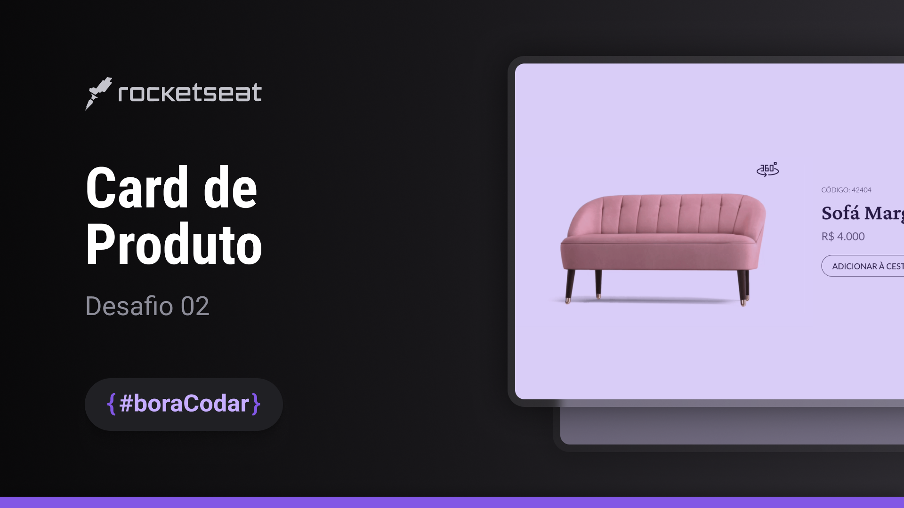

<h1 align="center"> Card de Produto </h1>

  <a href="#-tecnologias">Tecnologias</a>&nbsp;&nbsp;&nbsp;|&nbsp;&nbsp;&nbsp;
  <a href="#-projeto">Projeto</a>&nbsp;&nbsp;&nbsp;|&nbsp;&nbsp;&nbsp;
  <a href="#-layout">Layout</a>&nbsp;&nbsp;&nbsp;|&nbsp;&nbsp;&nbsp;
  <a href="#memo-licença">Licença</a>

  

 

  

## 🚀 Tecnologias

Esse projeto foi desenvolvido com as seguintes tecnologias:

- HTML, CSS e JS
- Git e Github
- Figma
- Visual Studio Code

## 💻 Projeto

O card de produto é uma representação visual de um item disponível para venda. Ele fornece informações essenciais sobre o produto, como nome, imagem, preço e uma breve descrição. Além disso, este card inclui uma opção para visualizar o produto em 360 graus, permitindo aos usuários uma experiência interativa e detalhada.

## 🔖 Layout

Você pode visualizar o layout do projeto através [DESSE LINK](https://www.figma.com/community/file/1195050984449538256/card-de-produto-desafio-02). É necessário ter conta no [Figma](https://figma.com) para acessá-lo.

## 📝 Licença

Esse projeto está sob a licença MIT.

---

Feito com ♥ by Hazzard 👋